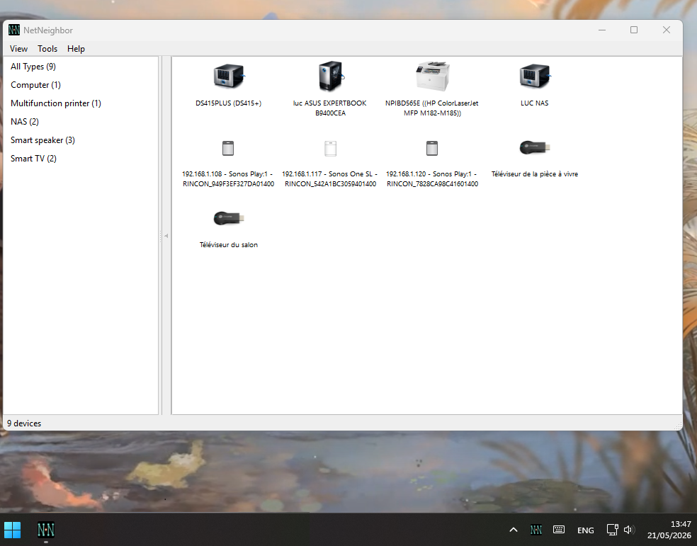

# NetNeighbor

NetNeighbor is a Linux desktop application that discovers and monitors devices on your
local network — a modern equivalent of the Windows Network Neighborhood experience.

**Current release: 1.0.0**



## Features

- **Automatic discovery** — SSDP, mDNS/Bonjour, WS-Discovery, NetBIOS; no active port scan
- **Instant startup** — previously-seen devices appear from cache in < 100 ms
- **List and icon grid** views with sidebar categories (by type or location)
- **Open devices** in one click — HTTP, HTTPS, SMB, SSH, FTP, SFTP, Telnet with configurable priority
- **Per-device overrides** — custom name, type, location, icon, and connection commands
- **System tray** — minimize to tray, start minimized, session autostart
- **Localised** — French, Spanish, German, Italian, Dutch, Japanese, Chinese (Simplified/Traditional)
- **Packaged** as `.deb` (Ubuntu/Mint/Debian), `.AppImage`, and tarball

## Download

Latest release: [GitHub Releases](https://github.com/luc-github/NetNeighbor/releases)

Available formats: `.deb` · `.AppImage` · `.tar.gz`

## Requirements

- Linux desktop with GTK 3
- Python 3.10+

### Ubuntu / Linux Mint / Debian

```bash
sudo apt install -y python3-gi python3-gi-cairo gir1.2-gtk-3.0
sudo apt install -y samba-common-bin                             # NetBIOS names
sudo apt install -y gir1.2-ayatanaappindicator3-0.1             # system tray
```

These dependencies are installed automatically when using the `.deb` package.

## Install

**`.deb` package (recommended):**
```bash
sudo dpkg -i netneighbor_1.0.0_amd64.deb
```

**`.AppImage`:**
```bash
chmod +x NetNeighbor-1.0.0-x86_64.AppImage
./NetNeighbor-1.0.0-x86_64.AppImage
```

**Tarball:**
```bash
tar -xzf netneighbor-1.0.0.tar.gz
cd netneighbor-1.0.0
bash install-user-desktop.sh   # optional: add menu shortcut
bash run.sh
```

## Run from source

```bash
python -m venv .venv --system-site-packages
source .venv/bin/activate
pip install -r requirements.txt
python main.py
```

Demo data is enabled by default. Disable with:
```bash
NETNEIGHBOR_DEMO=0 python main.py
```

## Documentation

User documentation: [`USER_DOCUMENTATION.md`](USER_DOCUMENTATION.md)

Developer documentation: [`docs/README.md`](docs/README.md)

## Translations

| Language | Code | Status |
|----------|------|--------|
| French | `fr` | Complete |
| Italian | `it` | Complete |
| Spanish | `es` | Complete |
| German | `de` | Complete |
| Dutch | `nl` | Complete |
| Traditional Chinese | `zh_TW` | Complete |
| Simplified Chinese | `zh_CN` | Complete |
| Japanese | `ja` | Complete |

Compile after editing a `.po` file:
```bash
msgfmt locale/fr/LC_MESSAGES/netneighbor.po -o locale/fr/LC_MESSAGES/netneighbor.mo
```

Test in a specific language:
```bash
LANG=fr_FR.UTF-8 python main.py
```

Full i18n workflow: [`docs/I18N.md`](docs/I18N.md)

## Autodetection and corrections

Device names and types are inferred from protocol announcements — they are best-effort.
Use right-click → **Type / Rename / Location / Icon** for per-device corrections.
Community rule overlays: [`docs/COMMUNITY_OVERRIDES.md`](docs/COMMUNITY_OVERRIDES.md).

## Pending work

[`docs/TODO.md`](docs/TODO.md)

Contribution and maintenance notes: [`docs/MAINTENANCE.md`](docs/MAINTENANCE.md)
