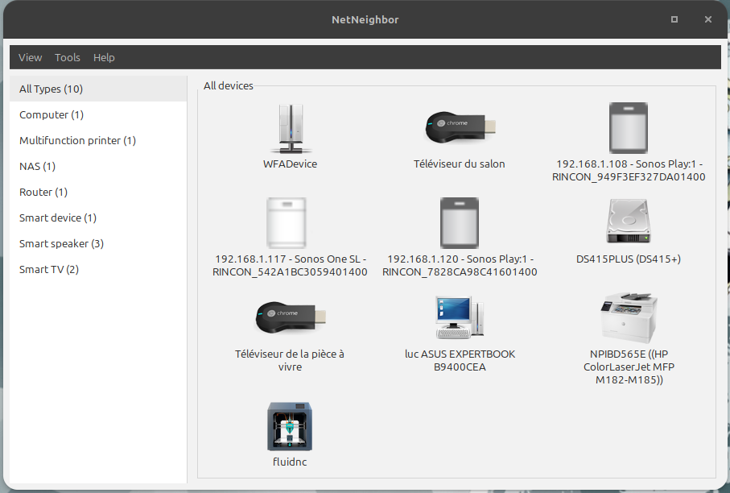
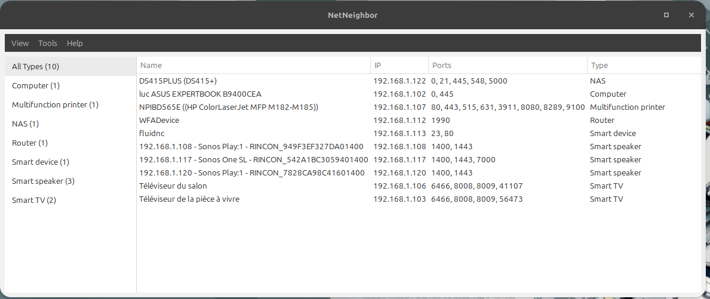
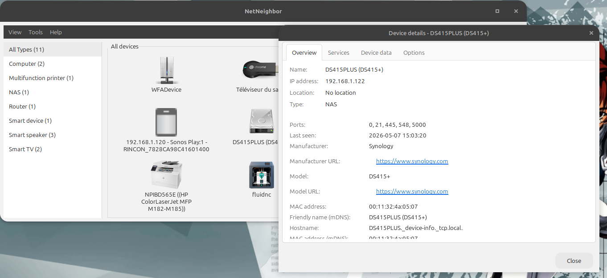
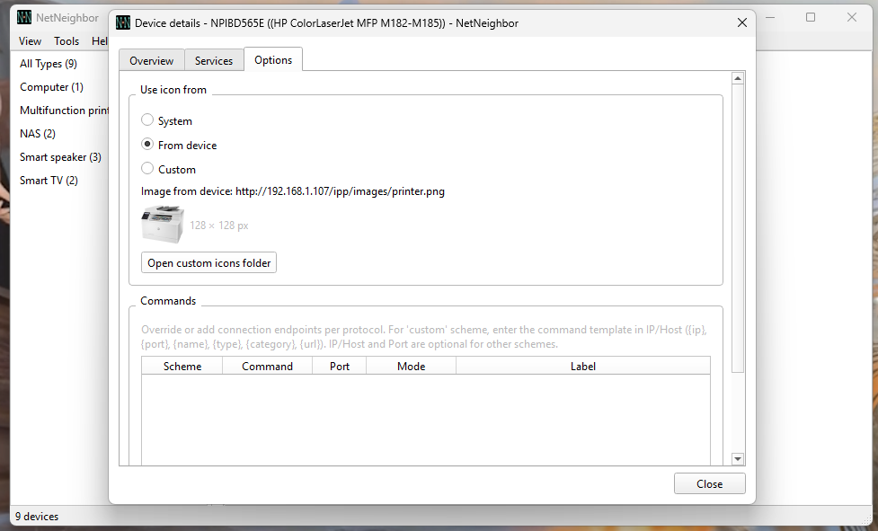
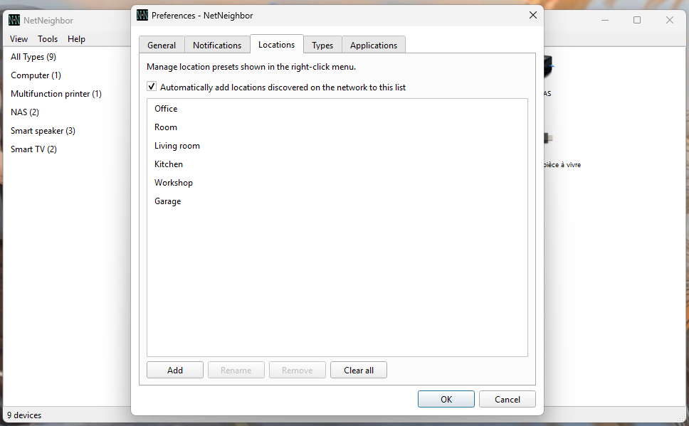
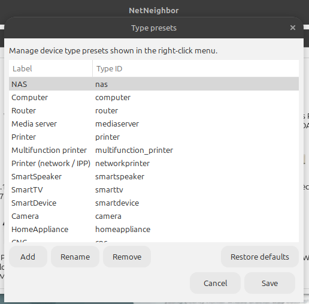
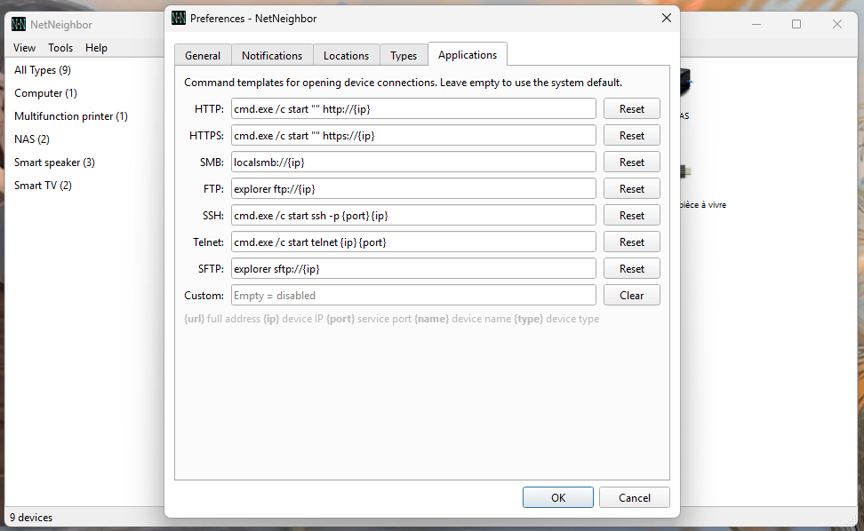

# NetNeighbor — User Documentation

## What is NetNeighbor?

NetNeighbor discovers and monitors devices on your local network.
It listens for device announcements (SSDP, mDNS/Bonjour, WS-Discovery, NetBIOS) and
displays them with icons or in a list — no active port scan required.

Previously-seen devices appear instantly at startup from the local cache; live discovery
updates them within a few seconds.

One NetNeighbor instance is allowed at a time; a second launch raises the existing window.

---

## Main window

- **List view** and **icon grid** — toggle from **View → Display**
- **Sidebar**: categories grouped by device type or location (**View → Arrange**)
- **View → Reload discovery**: force an immediate refresh of all discovery protocols

### Menu bar

#### View menu

| Item | Description |
|------|-------------|
| **Reload discovery** | Force refresh of all discovery protocols |
| **Sidebar** | Show/hide the left sidebar |
| **Display → Icons / List** | Switch between icon grid and list view |
| **Arrange → Unsorted / by Type / by Location** | Group devices in the sidebar and grid |
| **Icons size → Small / Medium / Large / Extra large** | Icon grid tile size (icon view only) |
| **Preferences…** (`Ctrl+,`) | Open the preferences dialog |
| **Quit** (`Ctrl+Q`) | Quit the application |

#### Tools menu

| Item | Description |
|------|-------------|
| **Notifications history** | View past device online/offline notifications |
| **Hidden devices** | Manage devices that have been hidden from the main view |

#### Help menu

| Item | Description |
|------|-------------|
| **About NetNeighbor** | Version information and credits |

### Icon view

Two arrangement modes controlled by **View → Arrange**:

- **Unsorted**: flat grid of all device tiles
- **by Type / by Location**: devices are grouped into collapsible sections (click the section header to collapse/expand)

### List view

Table with columns: **Name · IP · Type · Location · Online**. Click a column header to sort.

---

## Opening devices

**Double-click** or right-click → **Open** launches the best connection for that device.

Priority order: `HTTP → HTTPS → SMB → SSH → FTP → SFTP → Telnet`

For each scheme the resolution follows:
1. **Override** command (from the device's Options tab) — replaces the auto-detected default
2. **Detected** default (URL advertised by discovery)
3. **Additional** command (from the device's Options tab) — adds to the submenu without replacing
4. **Custom command** (from **View → Preferences… → Applications**)
5. Nothing — Open is disabled

When a device has **two or more** connection targets, right-click shows **Open ▶** with a submenu
listing all of them with labels (`HTTP`, `SSH (Admin)`, `HTTP (override)`, etc.).

---

## Right-click menu

| Action | Description |
|--------|-------------|
| **Open** / **Open ▶** | Launch connection (single target or submenu) |
| **Run custom command** | Execute the custom command set in **Preferences → Applications** (shown only if a template is configured) |
| **Details** | Open the details dialog (Overview, Services, Device data tabs) |
| **Options** | Open the details dialog directly on the Options tab (icon, connection commands) |
| **Monitor** / **Unfollow** | Keep the device visible when offline (greyed tile) / stop monitoring |
| **Hide device** | Remove this device from the main view (recoverable via **Tools → Hidden devices**) |
| **Rename** | Set a custom display name for this device |
| **Location ▶** | Assign a location label (Auto or preset list) |
| **Device type ▶** | Override the auto-detected device type (Auto or preset list) |

---

## Device details dialog

### Overview tab

Summary of discovered fields: IP, name, type, location, last seen, services.

### Services tab

mDNS service records with TXT fields. Right-click a TXT row to use a value as:
- **Use as Friendly name**
- **Use as Location**
- **Use as Information**

Also contains the **Field mapping rules** table (rules that map TXT records to device fields).

### Device data tab

Raw SSDP/UPnP XML received from the device. A **Copy to clipboard** button copies the full content.

### Options tab

**Icon source** — choose between:
- **System**: use the bundled type icon
- **From device**: use the icon fetched from the device's SSDP/mDNS URL (shown only when available)
- **Custom**: pick a PNG from the custom icons folder

**Connection commands** — per-device overrides and additional commands:

| Column | Description |
|--------|-------------|
| **Scheme** | `http`, `https`, `smb`, `ftp`, `ssh`, `sftp`, `telnet` |
| **Command** | Command template (leave empty for auto-detected URL) |
| **Port** | Leave empty or `0` to use the scheme default port |
| **Mode** | **Override** — replaces the auto-detected default. **Additional** — adds an extra entry in the Open submenu |
| **Label** | Display name shown in the submenu (e.g. `Admin`). When empty, auto-generated |

Click **Add** to add a row, **Delete** to remove the selected row, **Apply** to save.

Placeholders for command templates: `{url}  {ip}  {port}  {name}  {type}  {category}`

---

## Preferences

Open with **View → Preferences…** (`Ctrl+,`).

### General tab

**Theme**

| Option | Description |
|--------|-------------|
| **Light** | Force light colour scheme |
| **Auto** | Follow the OS/desktop setting |
| **Dark** | Force dark colour scheme |

**Session**

| Setting | Description |
|---------|-------------|
| **Close to system tray / panel instead of exiting** | Hide the window instead of quitting when closed (requires tray icon) |
| **Start minimized to tray** | Start hidden to the panel; open from the tray icon |
| **Start NetNeighbor when logging in** | Add/remove a session autostart entry (`~/.config/autostart/`) |

**Maintenance**

| Button | Description |
|--------|-------------|
| **Reset all application data…** | Permanently delete all settings, cached icons, discovery data and logs (confirmation required; restart recommended afterwards) |

### Notifications tab

| Option | Description |
|--------|-------------|
| **Notifications off** | No desktop notifications |
| **Monitored devices only** | Notify only for devices set to Monitor |
| **All devices** | Notify for every device coming online or going offline |

### Locations tab

Manage the list of location labels available in the right-click **Location** menu.

| Button | Action |
|--------|--------|
| **Add** | Create a new location label |
| **Rename** | Edit the selected label |
| **Remove** | Delete the selected label |
| **Clear all** | Remove all location presets |

Checkbox: **Automatically add locations discovered on the network to this list**

Labels are stored in `~/.config/netneighbor/ui_prefs.json`.

### Types tab

Manage the list of device types available in the right-click **Device type** menu.
Each entry has a **Label** (display name) and a **Type ID** (internal slug used for icon lookup).

| Button | Action |
|--------|--------|
| **Add** | Create a new type entry |
| **Edit** | Edit the selected entry |
| **Remove** | Delete the selected entry |
| **Restore defaults** | Reset to the built-in device types |

### Applications tab

Override the command used to open devices **per scheme** (HTTP, HTTPS, SMB, FTP, SSH, Telnet, SFTP).
Leave a field empty to use the system default (`xdg-open` for HTTP/HTTPS, file manager for SMB/FTP/SFTP, terminal for SSH/Telnet).

**Reset** restores the built-in default for that scheme.

**Custom** at the bottom sets the command run by **right-click → Run custom command** —
useful for port scans, terminal launchers, etc.

Placeholders: `{url}`, `{ip}`, `{port}`, `{name}`, `{type}`

---

## System tray

When the tray icon is active, the window can be shown/hidden from the tray.

| Tray action | Description |
|-------------|-------------|
| **Left-click** on icon | Toggle window visibility |
| **Show window** | Bring the main window to the foreground |
| **Hide window** | Send the main window to the tray |
| **Quit** | Quit the application |

---

## Autodetection is heuristic

Device names and types are inferred from SSDP, mDNS, and cached data. They are best-effort and
may not match every device or firmware revision.

Corrections:

1. **Per-device overrides**: right-click a device tile → **Rename**, **Device type**, **Location**, or **Options** (icon + connection commands).
2. **User rule overlays**: JSON files in `~/.config/netneighbor/` extend mDNS and SSDP matching
   (see [`docs/COMMUNITY_OVERRIDES.md`](docs/COMMUNITY_OVERRIDES.md)).

---

## Troubleshooting

**Device does not appear:**
- Confirm the device is on the same local network segment
- Allow UDP 1900 (SSDP multicast) through local firewall
- Wait a few seconds after startup; use **View → Reload discovery**

**Device appears/disappears:**
- SSDP `byebye` causes immediate offline; timeout-based offline if announcements stop
- Devices that sleep will disappear when their TTL expires

**Open is disabled:**
- No connection target was found; check the device's IP/services in Details
- Add a command manually in the device's Options tab

**NetBIOS names not showing:**
- Install `samba-common-bin` (`sudo apt install samba-common-bin`)

**No tray icon:**
- On Linux, tray support requires a system tray (most desktop environments include one)

**Icons wrong after a device firmware update:**
- Open **View → Preferences… → General → Reset all application data…** to clear the icon cache,
  or delete `~/.cache/netneighbor/remote_icon_index.json` and restart

---

## Screenshots to update

> The following screenshots were taken on the GTK 1.x version and need to be retaken
> with the Qt 2.0 UI before the next release:
>
> - `docs/screenshots/main-grid.png`
> - `docs/screenshots/menu-view.png`
> - `docs/screenshots/main-list.png`
> - `docs/screenshots/context-menu.png`
> - `docs/screenshots/device-details.png`
> - `docs/screenshots/device-options.png`
> - `docs/screenshots/location-presets.png`
> - `docs/screenshots/type-presets.png`
> - `docs/screenshots/external-applications.png`
> - `docs/screenshots/tray-menu.png`
