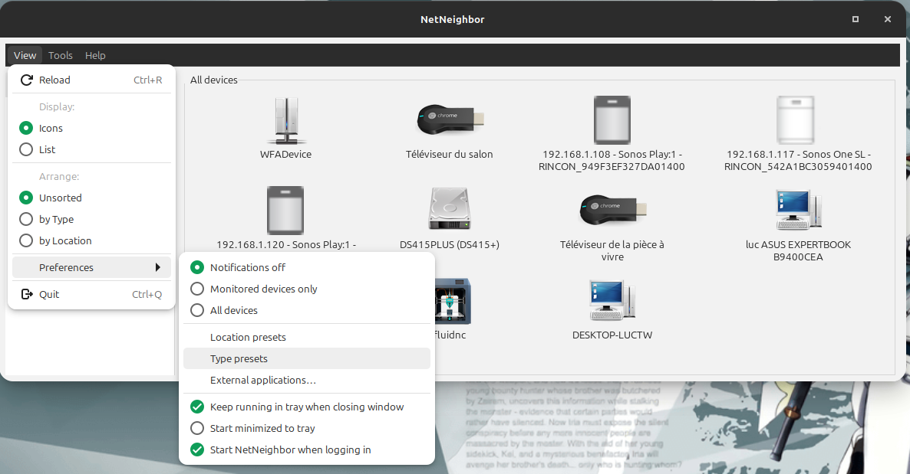

# NetNeighbor — User Documentation

## What is NetNeighbor?

NetNeighbor discovers and monitors devices on your local network.
It listens for device announcements (SSDP, mDNS/Bonjour, WS-Discovery, NetBIOS) and
displays them with icons or in a list — no active port scan required.

Previously-seen devices appear instantly at startup from the local cache; live discovery
updates them within a few seconds.

One NetNeighbor instance is allowed at a time; a second launch raises the existing window.

---

## Main window

- **List view** and **icon grid** — toggle from the View menu or toolbar
- **Sidebar**: categories grouped by device type or location (View → Arrange)
- **Search bar**: filter by name or type
- **F11**: toggle fullscreen (useful on small screens in icon grid)
- **View → Reload**: force an immediate refresh of all discovery protocols

---

## Opening devices

**Double-click** or right-click → **Open** launches the best connection for that device.

Priority order: `HTTP → HTTPS → SMB → SSH → FTP → SFTP → Telnet`

For each scheme the resolution follows:
1. **Override** command (from the device's Options tab) — replaces the auto-detected default
2. **Detected** default (URL advertised by discovery)
3. **Additional** command (from the device's Options tab) — adds to the submenu without replacing
4. **Custom command** (from Preferences → External applications…)
5. Nothing — Open is disabled

When a device has **two or more** connection targets, right-click shows **Open ▶** with a submenu
listing all of them with labels (`HTTP`, `SSH (Admin)`, `HTTP (override)`, etc.).

---

## Right-click menu

| Action | Description |
|--------|-------------|
| **Open** / **Open ▶** | Launch connection (single target or submenu) |
| **Details…** | Full details dialog with protocol fields, options, etc. |
| **Monitor** | Keep the device visible when offline (greyed tile) |
| **Type** | Override the auto-detected device type |
| **Rename** | Set a display name for this device |
| **Location** | Tag the device with a room or location label |
| **Icon** | Choose system, bundled, or custom icon |
| **Run custom command** | Execute the custom command set in Preferences → External applications… |

---

## Device details dialog

### Overview tab

Summary of discovered fields: IP, port, name, type, location, last seen, services.

### Options tab

Per-device connection commands. Click **+ Add command** to add a row:

| Field | Description |
|-------|-------------|
| **Scheme** | `http`, `https`, `smb`, `ftp`, `ssh`, `sftp`, `telnet` |
| **Mode** | **Override** — replaces the auto-detected default for this scheme on double-click. **Additional** — adds an extra entry in the Open submenu. |
| **Label** | Optional display name shown in the submenu (e.g. `Admin`, `NAS shares`). When empty, the label is auto-generated (`HTTP (override)`, `SSH`, …). |
| **IP** | Leave empty to use the device's discovered IP. Fill in to connect to a different address. |
| **Port** | Leave empty or `0` to use the scheme default port. |

Click **− Remove** to delete a row (confirmation required).

Available placeholders for the custom command field: `{ip}  {port}  {name}  {type}  {category}  {url}`

### Protocol tabs (SSDP, mDNS, WSD…)

Raw fields received from each discovery protocol. **SSDP details** includes parsed XML when available.

---

## Preferences

Open with **View → Preferences**.

### General options

| Setting | Description |
|---------|-------------|
| **Notifications** | Enable/disable desktop notifications for device online/offline transitions |
| **Close to tray** | Hide the window instead of quitting when the window is closed (requires tray icon) |
| **Start minimized to tray** | Start hidden to the panel; open from the tray icon |
| **Start NetNeighbor when logging in** | Add/remove a session autostart entry (`~/.config/autostart/`) |

### Location presets

**Preferences → Location presets…** manages the list of location labels available in the
right-click → Location menu.

| Button | Action |
|--------|--------|
| **Add** | Create a new location label |
| **Rename** | Edit the selected label |
| **Remove** | Delete the selected label (confirmation required) |
| **Restore defaults** | Reset the list to the built-in defaults |

Labels are stored in `~/.config/netneighbor/ui_prefs.json`.

### Type presets

**Preferences → Type presets…** manages the list of device types available in the
right-click → Type menu. Each entry has a **Label** (display name) and a **Type ID**
(internal slug used for icon lookup).

| Button | Action |
|--------|--------|
| **Add** | Create a new type entry (label + slug) |
| **Rename** | Edit the selected entry |
| **Remove** | Delete the selected entry (confirmation required) |
| **Restore defaults** | Reset to the 14 built-in device types |

### External applications

**Preferences → External applications…** overrides the command used to open devices
**per scheme** (HTTP, HTTPS, SMB, FTP, SSH, Telnet, SFTP).
Leave a field empty to use the system default (`xdg-open` for HTTP/HTTPS, file manager
for SMB/FTP/SFTP, terminal for SSH/Telnet).

Placeholders: `{url}`, `{ip}`, `{port}`, `{name}`, `{type}`, `{category}`

**Reset** restores the built-in default for that scheme (confirmation required).

**Custom command** at the bottom sets the command run by **right-click → Run custom command** —
useful for port scans, terminal launchers, etc. Same placeholders apply.

---

## System tray

When the tray icon is active, the main window uses a **client-side title bar** with Maximize and
Close buttons. Minimize-to-tray is available from the tray icon menu or by closing the window with
**Close to tray** enabled.

Tray menu: **Open** / **Minimize to tray** / **Quit**

---

## Autodetection is heuristic

Device names and types are inferred from SSDP, mDNS, and cached data. They are best-effort and
may not match every device or firmware revision.

Corrections:

1. **Per-device overrides**: right-click → Type / Rename / Location / Icon — stored in preferences,
   applied after discovery.
2. **User rule overlays**: JSON files in `~/.config/netneighbor/` extend mDNS and SSDP matching
   (see [`docs/COMMUNITY_OVERRIDES.md`](docs/COMMUNITY_OVERRIDES.md)).

---

## Troubleshooting

**Device does not appear:**
- Confirm the device is on the same local network segment
- Allow UDP 1900 (SSDP multicast) through local firewall
- Wait a few seconds after startup; use View → Reload

**Device appears/disappears:**
- SSDP `byebye` causes immediate offline; timeout-based offline if announcements stop
- Devices that sleep will disappear when their TTL expires

**Open is disabled:**
- No connection target was found; check the device's IP/services in Details
- Add a command manually in the device's Options tab

**NetBIOS names not showing:**
- Install `samba-common-bin` (`sudo apt install samba-common-bin`)

**No tray icon:**
- Install `gir1.2-ayatanaappindicator3-0.1` or `gir1.2-appindicator3-0.1`
