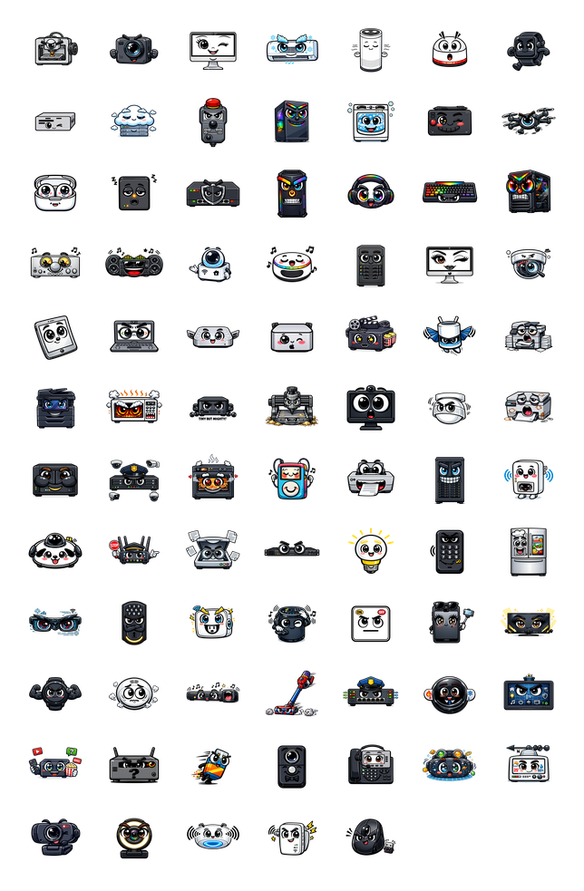
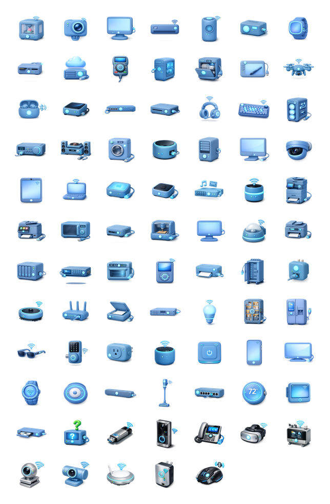
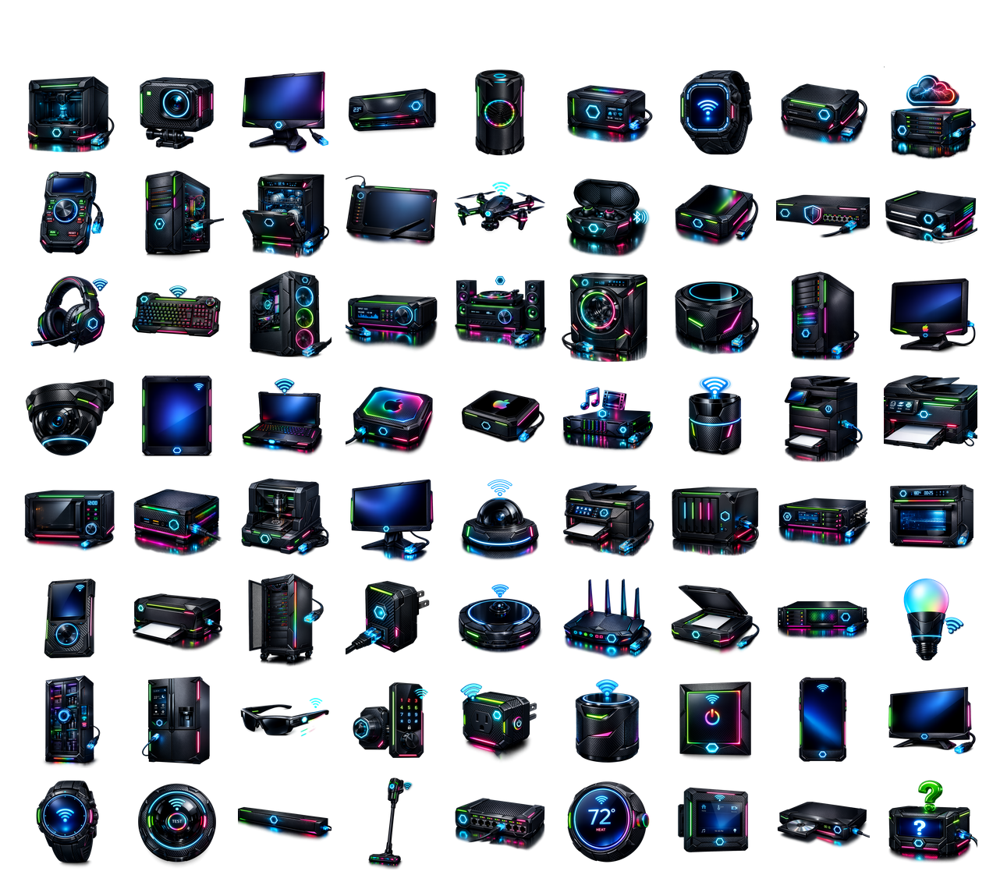
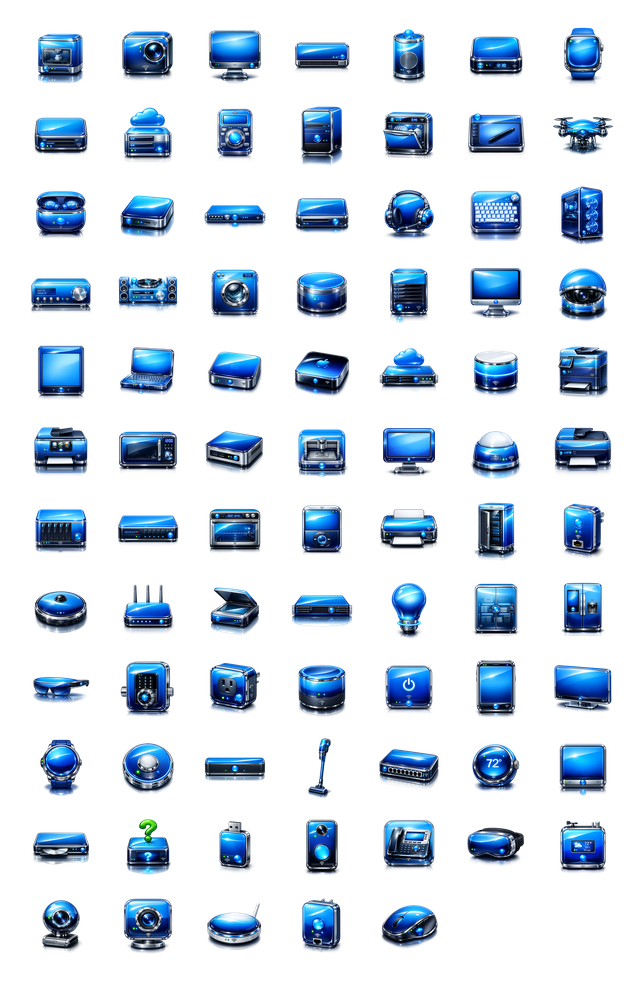
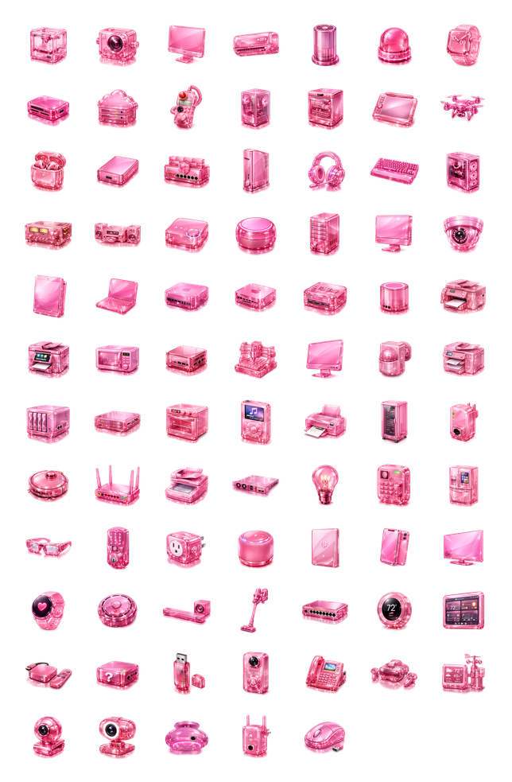
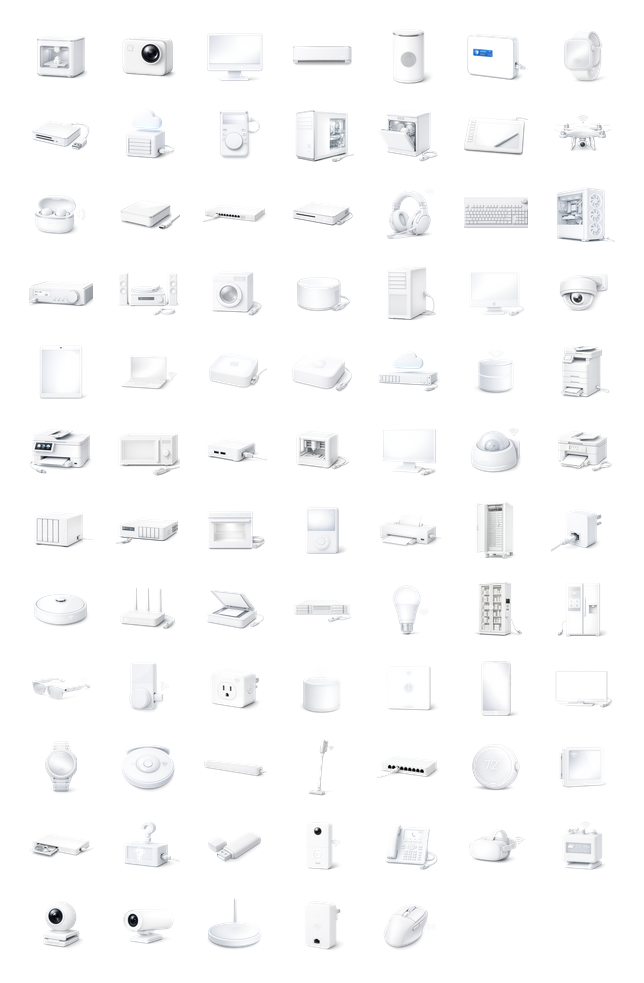
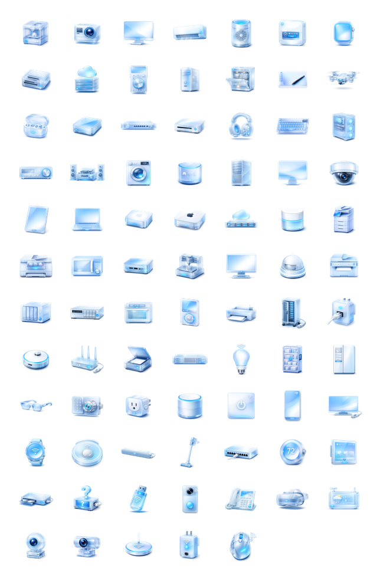

# NetNeighbor — Icon Packs

Community icon packs for [NetNeighbor](https://github.com/luc-github/NetNeighbor).

Each pack replaces the built-in device icons. Switch between packs in
**View → Preferences → General → Icon pack**.

---

## Available packs


### Cartoon



| | |
|---|---|
| **Folder** | `cartoon` |
| **Version** | 1.0 |
| **License** | LGPL-3.0 |


---

### Clay 3D



| | |
|---|---|
| **Folder** | `clay3d` |
| **Version** | 1.0 |
| **License** | LGPL-3.0 |

---

### Dark RGB



| | |
|---|---|
| **Folder** | `darkrgb` |
| **Version** | 1.0 |
| **License** | LGPL-3.0 |

---

### OSX Aqua



| | |
|---|---|
| **Folder** | `osx_aqua` |
| **Version** | 1.0 |
| **License** | LGPL-3.0 |

---

### Pinky



| | |
|---|---|
| **Folder** | `pinky` |
| **Version** | 1.0 |
| **License** | LGPL-3.0 |


---

### White Frost



| | |
|---|---|
| **Folder** | `whitefrost` |
| **Version** | 1.0 |
| **License** | LGPL-3.0 |

---

### Windows 11 Fluent



| | |
|---|---|
| **Folder** | `win11fluent` |
| **Version** | 1.0 |
| **License** | LGPL-3.0 |


---

## Installation

1. Copy the pack folder to `~/.config/netneighbor_icon_packs/` :

```
~/.config/netneighbor_icon_packs/
└── clay3d/          ← pack folder name = pack ID
    ├── 16/
    ├── 32/
    ├── 48/
    ...
    ├── iconpack.json
    └── preview.png
```

2. Rename `infopack.json` → `iconpack.json`

3. Rename `{packname}_preview.png` → `preview.png`

4. Restart NetNeighbor — the pack appears in **Preferences → General → Icon pack**.

> The pack folder survives **Reset all application data** because it lives outside
> `~/.config/netneighbor/`.

---

## Creating your own pack

See [`docs/contributing/CONTRIBUTING_ICONS.md`](../docs/contributing/CONTRIBUTING_ICONS.md)
for the full icon naming conventions, resolution requirements, and how to submit
a community pack.
